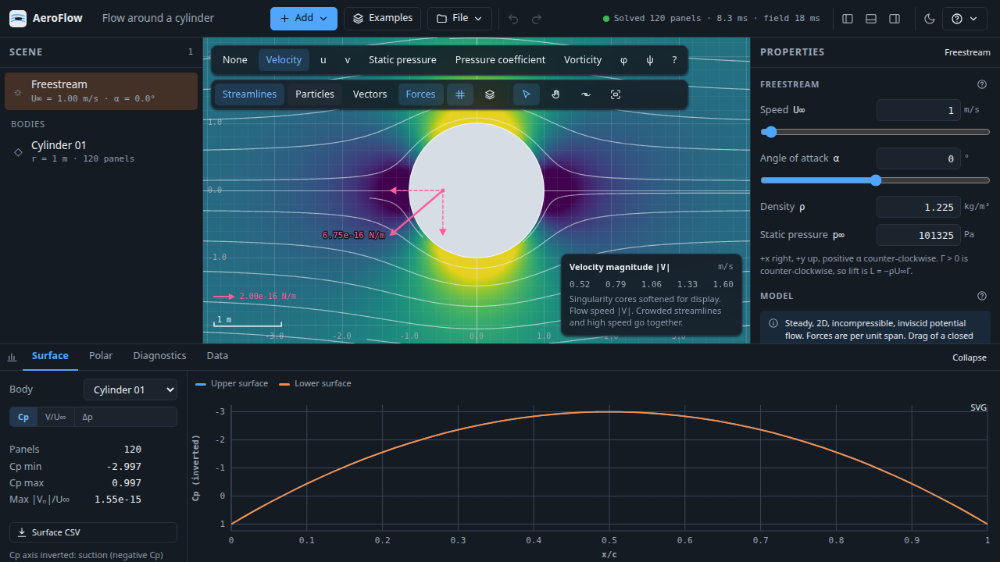
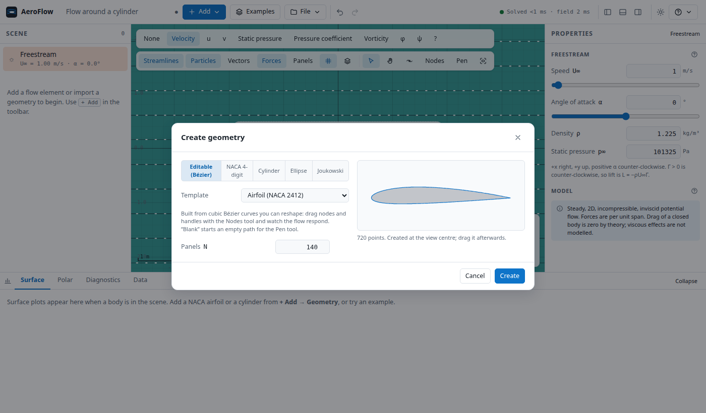
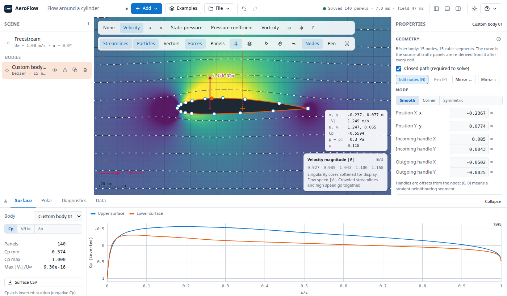
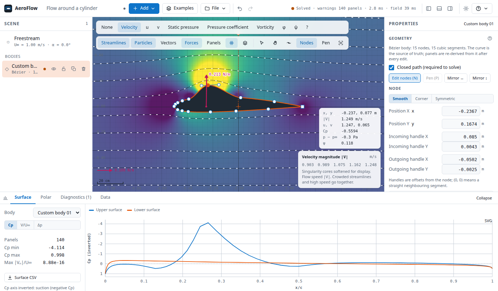
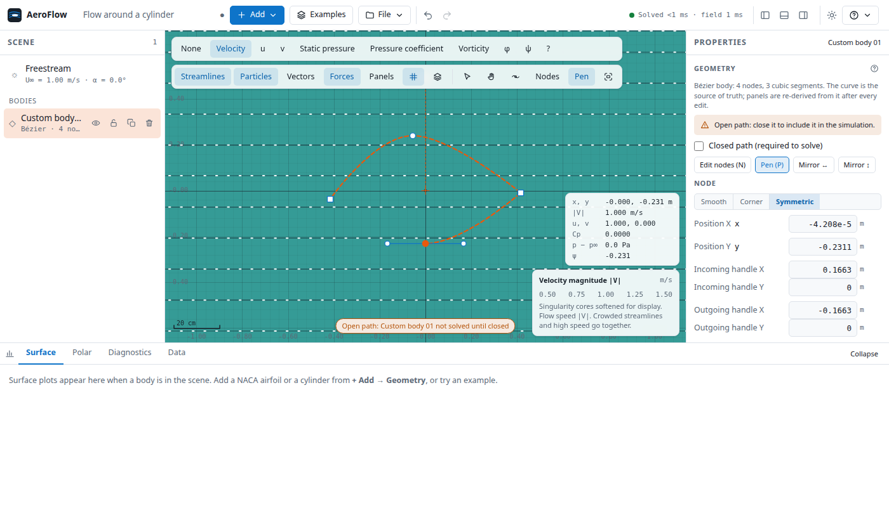
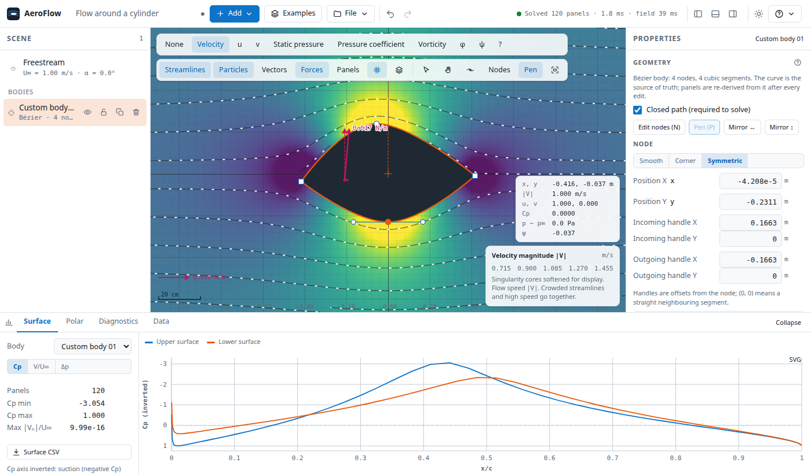
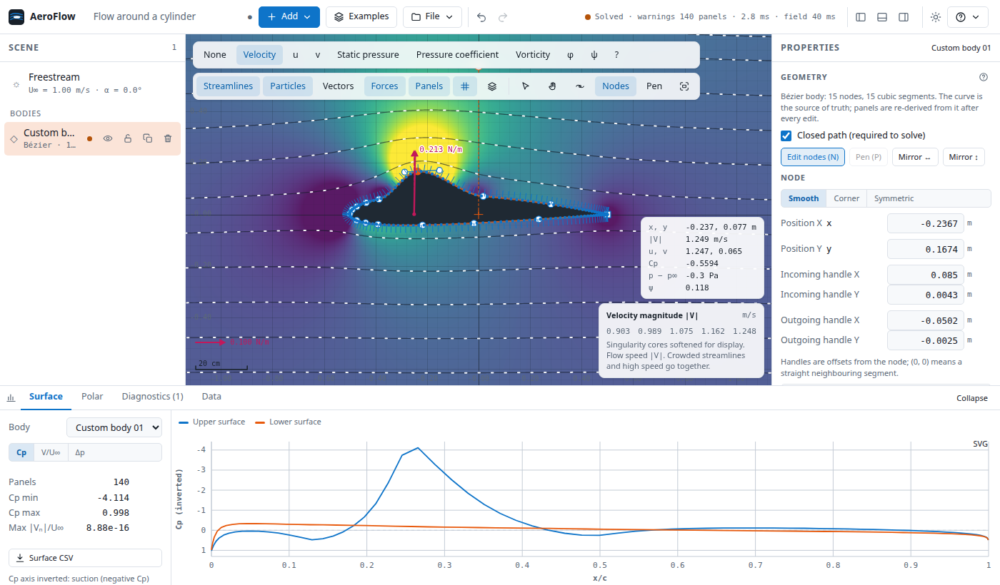

-# AeroFlow — 2D Potential Flow Simulator

An interactive browser application for building, solving and visualising 2D
incompressible potential flows. Drop in sources, sinks, vortices, doublets and
airfoils, drag them around, and the flow responds in real time. A Hess–Smith panel
method written in Rust runs as WebAssembly in a Web Worker, and every result comes
with diagnostics that show how trustworthy it is.



## Quick start

Prerequisites: Rust (stable, `wasm32-unknown-unknown` target), [`wasm-pack`](https://rustwasm.github.io/wasm-pack/), Node.js ≥ 20.

```bash
rustup target add wasm32-unknown-unknown
cd apps/web
npm install
npm run wasm      # builds the solver into src/wasm/pkg (git-ignored — required once)
npm run dev       # http://localhost:5173
```

Production build: `npm run build` → `apps/web/dist/` (static files; serve with any
static host — the worker and `.wasm` are emitted as hashed assets).

> **System `wasm-opt`:** older distro binaryen (e.g. v108) corrupts wasm-bindgen's
> externref table (`WebAssembly.Table.grow(): failed to grow table`). The wasm-pack
> profile therefore disables `wasm-opt`; the Rust release profile already applies
> LTO and `opt-level = 3`.

## What it does

| | |
| --- | --- |
| **Elements** | uniform flow, source, sink, vortex, doublet — analytic, superposed |
| **Bodies** | NACA 4-digit, cylinder, ellipse, Joukowski, imported coordinates (`.csv`, Selig/Lednicer `.dat`, `.txt`), or **editable Bézier shapes** (see below) |
| **Solver** | Hess–Smith constant-strength source panels + one vortex strength per body; Kutta condition at sharp trailing edges (auto-detected), zero or prescribed circulation otherwise; all bodies coupled in one global system |
| **Fields** | velocity magnitude / u / v, pressure, Cp, vorticity, potential φ, stream function ψ — WebGL2, perceptual colour maps, contour bands, isolines |
| **Overlays** | evenly spaced streamlines (Jobard–Lefer) with animated particles, velocity vectors, manual seeds, hover probe |
| **Results** | lift, drag, Fx, Fy, moment, CL, CD, Cm per body and in total; Kutta–Joukowski cross-check; surface Cp / velocity / pressure plots |
| **Forces** | force arrows on the canvas (body resultant with lift/drag components; shared scale with a key); forces on elementary singularities from the **Lagally theorem**, validated against the circle theorem and against the pressure force on nearby bodies |
| **Sweeps** | angle of attack, freestream speed, body circulation or element strength — CL/Cm curves and drag polar, cancellable |
| **Files** | `.aeroflow.json` save/open (versioned); CSV export of forces, surface data, geometry and fields; PNG canvas and SVG charts |
| **UX** | resizable side and bottom panels (drag an edge; double-click resets; sizes remembered), undo/redo, keyboard shortcuts (press `?`), contextual help, light/dark/system themes, compact layout for tablet and phone |

Try the shipped coordinate file `examples/naca2412-selig.dat` via **Add → Import coordinates**.

### Editable Bézier bodies — user guide

Draw or reshape a body and watch the flow, pressure and forces recompute as you move it.
The curve you edit is made of **cubic Bézier segments** joined at **nodes**; each node has an *incoming* and an *outgoing* **handle** that set the tangent direction and how tightly the curve bends.

#### 1. Create a body

**Add → Create geometry → Editable (Bézier)**, pick a template (NACA 2412 or 0012 airfoil, circle, ellipse, flat plate, rounded plate, rounded rectangle) or **Blank** to draw your own with the pen, then **Create**. Templates open straight into the Node tool.



#### 2. Edit nodes and handles — Node tool (`N`)

| Do this | To get this |
| --- | --- |
| Click a node | Select it; its handles appear and the **Node** form opens in the properties panel |
| Drag a node or a handle | Move it. The panels are regenerated and the flow re-solved while you drag |
| Shift-click, or drag a box on the background | Select several nodes (they move together) |
| Click the curve | Insert a node there. The curve does not change (exact subdivision) |
| Double-click a node | Toggle sharp **corner** ↔ **smooth** |
| Arrow keys (Shift ×10, Alt ×0.1) | Nudge the selected nodes |
| `Delete` | Remove selected nodes (a closed shape keeps at least 3) |

Node types: **Smooth** keeps both handles on one line (continuous tangent, e.g. a rounded leading edge). **Corner** lets the handles point anywhere (a sharp trailing edge — this is what the solver uses for the Kutta condition). **Symmetric** keeps the handles opposite and equal.
The node form also takes exact numbers for position and both handles, which is the precise (and keyboard-only) way to edit.



Drag the upper-surface node upward and the camber changes: the Cp plot, lift and streamlines follow. `Ctrl/⌘ + Z` undoes the whole drag in one step.



#### 3. Draw a new shape — Pen tool (`P`)

Click for a corner node, **click-and-drag** for a smooth node (the drag sets the handle), and click the **first node** to close the path. With nothing selected the pen starts a new body. An *open* path is drawn dashed and is not solved until it is closed (or tick **Closed path** in the properties panel).





#### 4. See the panels

**Panels** (`K`) draws the panel mesh the solver actually uses: vertices, outward normals, and indices on coarse meshes. Change **Panels → Panel count / Distribution** in the properties panel to refine it.



#### 5. Other operations

- **Mirror ↔ / ↕** flips the shape in place; **Closed path** opens or closes it.
- Move, rotate, scale, duplicate (`Ctrl/⌘ + D`), hide and lock work as for any body; a locked body still takes part in the simulation but its nodes cannot be edited.
- **Add → Import coordinates → Convert to editable Bézier curves** fits an imported contour within a tolerance you choose (percent of the shape's size). Sharp corners stay sharp, and the result is labelled as an approximation with its largest deviation.
- **File → Save** keeps every control point (scenes with Bézier bodies are written as format v2; all other scenes stay v1). **Export → Bézier outline** writes the sampled curve as CSV.

#### How it works, and what to expect

- The Bézier curve is the source of truth. Just before each solve it is sampled to a contour, which the Rust solver re-panels; the solver never sees Bézier data.
- While you drag, the solve uses 64 panels for responsiveness; once you pause it is re-solved at the configured panel count. Every result is tagged with the geometry revision it was computed for, and a result that trails the geometry is marked *Updating flow…* at the bottom of the canvas.
- A shape that is open, has fewer than 3 nodes, or **crosses itself** is flagged (crossings are marked with a red ✕) and left out of the solve, rather than solved as something you did not draw.
- This is inviscid potential flow: a very thin or sharply kinked shape gives sharp, local Cp peaks that are real features of the model, not errors.

## Model and its limits

Steady, two-dimensional, incompressible, inviscid flow, irrotational except at the
singularities. Forces are **per unit span**. There is no boundary layer, so no skin
friction, separation or stall: the drag of a closed body is zero in theory
(d'Alembert), and the small value reported is discretisation error, not a prediction.
The app states this next to every drag value.

Conventions: `+x` right, `+y` up, angles counter-clockwise, **circulation `Γ > 0`
counter-clockwise** — so lift is `L = −ρU∞Γ` and a clockwise circulation lifts.

## Accuracy

Validated against closed-form solutions and XFOIL; tolerances are measured, not
assumed — see [`tests/numerical/TOLERANCES.md`](tests/numerical/TOLERANCES.md).

| Case | Result |
| --- | --- |
| Cylinder, Cp at panel midpoints | exact to 3×10⁻¹⁵ for every panel count |
| Ellipse surface speed | second-order convergence |
| Spinning cylinder vs. Kutta–Joukowski | lift within 0.43 % |
| NACA 0012, α = 5° | CL 0.6025 (XFOIL ≈ 0.600), lift slope 6.91/rad |
| NACA 2412, α = 0° | CL 0.255, Cm −0.054 (XFOIL ≈ −0.053), α₀ = −2.12° |
| Joukowski (true cusp) | first-order: −4.2 % at 400 panels (documented limitation of source panels) |

## Performance

Measured in Chromium ([`docs/PERFORMANCE.md`](docs/PERFORMANCE.md)): 60 FPS held at
every size, including while a 1000-panel system is being factorised; dragging re-solves
against a cached factorisation in ~20 ms round trip even at 1000 panels.

## Repository layout

```
crates/
  geometry/        Vec2, polygons, parsing, validation, re-panelisation, shapes, trailing-edge detection
  linear-algebra/  dense LU with partial pivoting, Hager condition estimate
  flow-core/       elementary solutions, panel influence kernel, fields, streamlines, forces, help text
  panel-method/    global Hess–Smith assembly and solve, Kutta rows, diagnostics
  solver/          scene format, body preparation, matrix caching, sweeps, probes
  wasm-api/        thin wasm-bindgen boundary
apps/web/          React 19 + TypeScript + Vite + Zustand front end
examples/          bundled examples as .aeroflow.json (generated: npm run examples) + a Selig .dat
tests/numerical/   measured tolerance report
docs/              PRD, progress log, performance and verification reports
```

Architecture notes and every design decision, with the reasoning, are in
[`docs/IMPLEMENTATION_PROGRESS.md`](docs/IMPLEMENTATION_PROGRESS.md).

## Testing

```bash
scripts/verify.sh            # everything: fmt, clippy, Rust, WASM, tsc, Vitest, Playwright (dev + production)
SKIP_E2E=1 scripts/verify.sh # without the browser suites
```

| Suite | Count | Covers |
| --- | --- | --- |
| Rust | 295 | analytical acceptance, solver/geometry units, TS↔Rust scene contract on every example |
| Vitest | 50 | domain helpers, viewport math, colour maps, worker client coalescing, CSV, example fixtures, module boundaries |
| Playwright | 41 + 3 | PRD core flows, visual baselines, axe WCAG 2.2 AA scans, keyboard-only use, responsive layouts, performance, production-build smoke |

Visual baselines live in `apps/web/e2e/visual.spec.ts-snapshots/`; after an intended
visual change regenerate with `npx playwright test e2e/visual.spec.ts --update-snapshots=all`.

## License

MIT — see [LICENSE](LICENSE).
