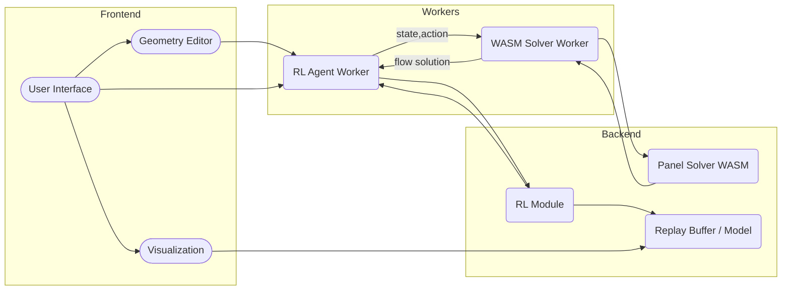
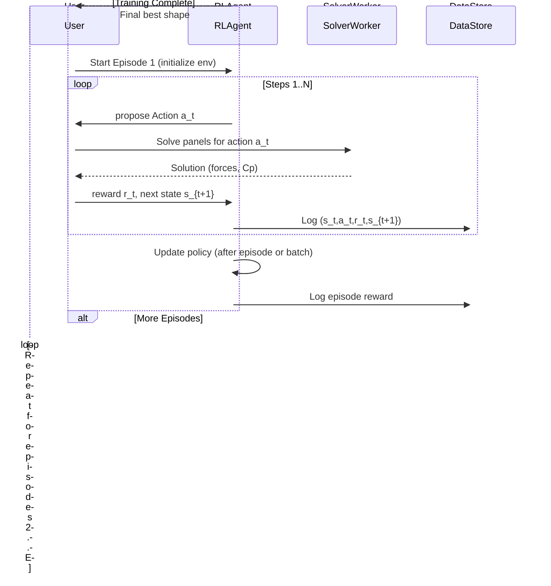

# Product Requirements Document (PRD)
# RL-Augmented Aerodynamic Shape Optimization

**Working name:** AeroFlow-RL Optimization Module  
**Document type:** Product Requirements Document  
**Version:** 1.0  
**Status:** Implementation-ready, agent-friendly  
**Primary consumers:** RL agents, frontend/UI agents, WASM solver agents, QA agents, surrogate-modeling agents

**Executive Summary:** We extend the AeroFlow webapp (2D potential-flow simulator with Bézier geometry editor) to support **reinforcement-learning (RL)-based shape optimization**. Users can launch RL-driven optimization of custom geometries to maximize an aerodynamic objective (e.g. lift-to-drag ratio), subject to configurable constraints. The RL system is **educational and transparent**: users see live metrics and visualizations of agent training, episode rewards, and evolving shapes. Multiple RL algorithms (PPO, DDPG, SAC, ES, Bayesian hybrid, etc.) are supported, with sensible defaults. The solver (WASM panel-method) runs in a Web Worker; an RL worker or process interacts with it in a Gym-like loop. The user interface provides **live dashboards** (reward curves, parameter sliders, policy summaries, shape comparisons) and **step-through replays** of agent episodes. Key concerns include sample efficiency (via surrogates, transfer learning, etc.), geometric validity (no self-intersection, manufacturability), multi-objective handling (weighted or Pareto), and responsiveness (preview vs final solves). We define clear RL problem components (state, action, reward), shared schemas (state/action/solver interfaces), and agent responsibilities. Implementation tasks are ordered from low-level RL environment and solver integration to high-level visualization and testing. This PRD is intended as a **detailed technical blueprint** for an agentic implementation team.

---

## 1. Goals

- **G-RL-001:** Enable RL-based optimization of aerodynamic shapes within AeroFlow.
- **G-RL-002:** Formulate shape design as an MDP (state, action, reward, episode).
- **G-RL-003:** Provide interactive control: user can define objectives, constraints, and monitor training in real time.
- **G-RL-004:** Support multiple RL algorithms suited for continuous control: on-policy (PPO, policy gradients), off-policy (DDPG, SAC), evolutionary (CMA-ES, genetic), and Bayesian optimization hybrids.
- **G-RL-005:** Allow custom reward functions (single or weighted multi-objective metrics: $C_L$, $C_D$, $L/D$, moment, Cp-shape, robustness, etc.).
- **G-RL-006:** Ensure geometric validity and manufacturability (constraints on thickness, curvature, no self-intersect) during optimization.
- **G-RL-007:** Integrate solver as “simulation in the loop” via WebAssembly + Web Worker. Provide preview (fast, low-res) and final (accurate) evaluations.
- **G-RL-008:** Expose training progress and policy behavior through educational visualizations (reward graphs, shape evolution, policy/value heatmaps, reward decomposition charts).
- **G-RL-009:** Achieve sample efficiency: use surrogate models, transfer learning, imitation demos, and model-based strategies when possible.
- **G-RL-010:** Provide APIs and schemas for RL-software integration, including solver requests/responses, revision IDs, caching.
- **G-RL-011:** Facilitate experiment management: runs, random seeds, checkpoints, log export/import.
- **G-RL-012:** Maintain interactivity: UI remains responsive (60 FPS), solver/agent run off the main thread.  
- **G-RL-013:** Ensure reproducibility and explainability: log data, allow step-through, and compare agent solutions with baseline airfoils.

---

## 2. Non-Goals

- **G-RL-NG-001:** Not a full production-ready auto-optimizer; human oversight is expected.  
- **G-RL-NG-002:** No guarantee of physically realizable 3D designs or Navier-Stokes fidelity (remains inviscid, 2D panel method).  
- **G-RL-NG-003:** No advanced CAD/CAM features beyond Bézier curve editing.  
- **G-RL-NG-004:** Not focusing on extreme multi-objective Pareto front generation (only basic weighting).  
- **G-RL-NG-005:** Does not replace manual design expertise; it is an *assistive* educational tool.  
- **G-RL-NG-006:** We do not require implementing large-scale distributed RL; agent runs on user hardware (browsers).

---

## 3. Target Personas

- **Aerospace/Engineering Student:** Learns how shape changes affect aerodynamics by watching an RL agent optimize geometry.  
- **Aerodynamics Educator:** Uses RL as a demonstration of optimization, illustrating concepts like local optima, reward shaping, and sample efficiency.  
- **Design Engineer (Learner):** Prototypes shapes quickly and sees what an automated agent would do to improve performance.  
- **Machine Learning Practitioner:** Wants to experiment with RL algorithms on a fluid dynamics problem with visual feedback.  
- **Reviewer/Researcher:** Tests and evaluates RL results (needs reproducibility, logging, policy inspection).

---

## 4. Core Concepts

1. **Geometry as State:** The **MDP state** includes the current shape parameters (Bézier control points or derived coordinates) and possibly current aerodynamics outputs (e.g. current lift/drag).  
2. **Actions (Shape Edits):** Actions modify the shape. For example, “increase local camber by Δ at chord fraction x” or “move control node i by (dx,dy)”. Actions are continuous (Bézier control offsets) and possibly discrete choices (which node to edit).  
3. **Reward Function:** By default, reward = objective metric (e.g. L/D) or a combination of metrics. Can include penalties for constraint violation (invalid geometry ⇒ large negative reward) and regularization (e.g. minimal material penalty).  
4. **Episode:** A sequence of N shape edits (steps) starting from an initial geometry. At episode end (fixed horizon or upon invalid shape), cumulative reward is evaluated.  
5. **Constraints:** Hard and soft constraints on shape (e.g. min thickness, symmetry, smoothness). If violated, penalize or terminate episodes early.  
6. **Metrics:** Lift coefficient $C_L$, drag coefficient $C_D$, lift-to-drag ratio $C_L/C_D$, pitching moment, area, curvature, robustness to AoA changes.  
7. **Multi-Objective Handling:** Users may specify multiple objectives. System offers:  
   - Weighted sum (scalarize reward = w1·obj1 + w2·obj2…).  
   - Pareto front exploration (running parallel agents with different weightings).  
8. **Surrogates & Hybrid:** For sample efficiency, an ML surrogate (e.g. neural net or Gaussian process) may approximate aerodynamics to propose steps, occasionally corrected by the true solver.  
9. **Preview vs Final Evaluation:** During training (fast exploration), use coarse solver (fewer panels) for speed. After training or at key checkpoints, run high-fidelity solves to validate results.  
10. **Human in Loop:** User can start, pause, or modify RL process; e.g. adjusting reward weights or constraints and resuming.  
11. **Explainability:** Visualize how each action changes metrics (e.g. heatmap of $\Delta C_p$ across shape edits) so the agent’s “intent” is transparent.

---

## 5. RL Problem Formulation (MDP)

Define the aerodynamic shape optimization as a Markov Decision Process:

- **State (S):** Representation of the current geometry. This may include:  
  - Bézier control points or node coordinates (raw or normalized)  
  - Derived geometry features (max thickness, camber line parameters)  
  - Current aerodynamic metrics (e.g. $C_L$, $C_D$, moment) could optionally augment state  
  - [Agent Task] The **GeometryState** schema: e.g. `{nodes: Vec2[], handles: Vec2[], transform: Transform}`.
- **Action (A):** A modification to the shape. Examples:  
  - **MoveNode(i, dx, dy):** displace node i by (dx,dy)  
  - **MoveHandle(i, dx, dy):** displace control-handle at node i  
  - **ChangeCamber(c, Δ):** increase camber at chord station c by Δ (affects two nodes)  
  - **ChangeThickness(c, Δ):** similar for thickness  
  - Actions are **continuous** vector values bounded by design limits (see Constraints).  
  - [Agent Task] The **RLAction** schema: e.g. `{type: "moveNode", nodeIndex: 3, delta: [0.01, -0.005]}`.
- **Transition:** The action deterministically produces a new geometry. Then the panel solver computes new flow. (No stochasticity unless flow solver fails.)
- **Reward (R):** Scalar feedback after each action (or at episode end) reflecting performance: e.g.  
  - $R = f(\text{current shape})$ such as $C_L/C_D$, or $C_L$ minus penalty for $C_D$.  
  - Could also combine multiple: e.g. $R = \alpha (C_L/C_D) + \beta C_L - \gamma C_{D} - \delta \text{(area)}$.  
  - Add negative reward if solver fails or shape invalid (e.g. self-intersect).  
- **Episode Length:** User-configurable or fixed number of steps (e.g. 20 moves per episode). Episode ends when maximum steps reached or shape invalid.
- **Constraints:**  
  - **Geometry Validity:** No self-intersection, min edge length, no degenerate Bézier, closed if required. Invalid shapes end episode or heavy penalty.  
  - **Manufacturability:** Minimum radius of curvature, smooth transitions; may limit control-handle moves (similar to thickness/camber limits in [12†L1045-L1054]).  
  - **Scale:** Shapes remain within realistic size (warn if extremely small/large like non-dimensional chord).  
  - **Physics:** Preserve trailing-edge closure (Kutta) if needed; do not change AoA without user intent (AoA can be fixed as an environment parameter).
- **Markov Property:** State fully encapsulates all needed info (current geometry and flows); history beyond the current shape is not needed.
- **Gym Interface:** The environment implements `reset()` (new episode), and `step(action) -> (state, reward, done, info)`. We reuse a Gym-like pattern.
  
By framing design as an MDP, the RL agent learns an optimal policy mapping shapes to shape-modifications. The agent’s **observation** at each step could be a vector of node coordinates, or an image-like encoding of the airfoil (less preferred, we have exact parametric state). The **action space** is continuous and multi-dimensional, so algorithms for continuous control (actor-critic, etc.) are suitable.

---

## 6. Objectives and Metrics

- **Primary Aerodynamic Metrics:**  
  - **Lift Coefficient ($C_L$).**  
  - **Drag Coefficient ($C_D$).**  
  - **Lift-to-Drag ($L/D$).**  Common aggregate measure.  
  - **Pitching Moment ($C_m$).** Maintain or control moment about quarter-chord.  
  - **Pressure Coefficient Distribution ($C_p$).** For deeper analysis, encourage smoother pressure curves or target pressure fields.  
- **Secondary Goals:**  
  - **Geometric Robustness:** e.g. maximize minimum thickness or robustness to perturbations.  
  - **Manufacturing Constraints:** e.g. minimize number of inflection points, avoid extreme curvature.  
  - **Symmetry (if needed):** keep upper/lower surfaces mirrored.  
- **Multi-Objective Handling:**  
  - Users can specify *weighted rewards*: e.g. reward = $w_1\, (L/D) + w_2\,C_L - w_3\,C_D - w_4\,|\Delta C_m|$. The RL agent optimizes the scalarized reward.  
  - Alternatively, a *Pareto-set* approach: run multiple agents with different weight vectors, then display Pareto frontier of results.  
- **Reward Shaping:**  
  - Provide intermediate rewards each step (instantaneous change in objective) to accelerate learning, not only terminal reward. For example, reward could be the change in $L/D$ relative to previous step.  
  - Potentially add small time-penalty to encourage shorter designs.  
- **Evaluation Metrics (for Validation):**  
  - Convergence of $L/D$ over training episodes.  
  - Best achieved lift and drag values vs baseline shapes (NACA, Gurov/Skinner shapes, etc.).  
  - Comparisons to known optima or analytic solutions (e.g. cylinder) where possible.  
  - Statistical consistency over random seeds (e.g. average best reward over 5 runs).  

> **Citation:** The RL agent’s objective maximizes aerodynamic metrics. For example, Dussauge *et al.* trained a PPO agent to maximize $L/D$, $C_L$, or minimize $C_D$, showing significant improvements within tens of episodes.

---

## 7. Supported RL Algorithms

We support a range of algorithms to suit continuous shape control and speed/sample requirements:

| Algorithm    | Type        | On/Off-Policy | Continuous Actions | Sample Efficiency | Stability      | Parallelism | Remarks |
|:-------------|:------------|:-------------|:------------------|:------------------|:--------------|:-----------|:--------|
| **PPO**      | Actor-Critic (PG)| On-policy    | Yes               | Moderate         | Very stable    | Easy (multiple envs) | Easy to tune; used successfully in prior work. Clip-based updates avoid large policy steps. |
| **DDPG**     | Actor-Critic  | Off-policy   | Yes               | Low               | Low            | Good (replay) | Deterministic actor, sample-inefficient, sensitive to hyperparams. Use only if needed. |
| **SAC**      | Actor-Critic  | Off-policy   | Yes               | High              | High           | Moderate     | Stochastic policy with entropy bonus; generally more sample-efficient and robust than DDPG. |
| **TD3**      | Actor-Critic  | Off-policy   | Yes               | High              | High           | Moderate     | Twin Delayed DDPG (improved DDPG). Use if DDPG needed. |
| **Policy Gradients (e.g. REINFORCE)** | PG       | On-policy    | Yes               | Low               | Unstable       | Good (parallel) | High variance, basic; not recommended alone for complex shapes. |
| **Evolutionary Strategies (ES)** | ES/CMA-ES  | Black-box    | Yes               | Low               | Very stable   | Excellent    | Parallelizable; no gradients; expensive but robust. Good for global search (coarse). |
| **Bayesian Optimization (BO)** | Surrogate    | N/A          | Yes (real)        | Very high        | Stable        | Poor        | Not RL, but we include GP-based search as hybrid. Good for few evals, multi-fidelity (low vs high panels). |
| **Hybrid (RL+BO)**           | Mixed        | ---          | Yes (real)        | High             | Stable        | Yes         | Use BO to propose candidates, refine with RL or vice versa. E.g. surrogate-actor-critic as in Sobieczky *et al.*. |

- **Sample Efficiency & Stability:** PPO is stable but less sample-efficient than SAC (on-policy vs off-policy). SAC and TD3 learn faster but require more careful tuning. [12] chose PPO for its simplicity and quick convergence, but SAC could be the default off-policy choice for rapid learning. 
- **Complexity:** PPO is mathematically simpler than TRPO or DDPG. SAC introduces entropy hyperparameter. DDPG/TD3 need tuning of replay buffers.
- **Parallelism:** ES and BO can explore many candidates in parallel easily; SAC/TD3 benefit from large replay but not trivial to parallelize across threads.
- **Multi-Objective:** All above can use scalarized reward. Multi-objective-specific methods (like Pareto-front NSGA-II) are out of scope for MVP, but weighted sum is supported.
- **Recommended Defaults:** **PPO** (default agent, robust) or **SAC** (more efficient, if configured). Option to switch algorithms via UI or config.  

> **Citations:** PPO handles continuous actions well and learns quickly. SAC adds entropy regularization to encourage exploration. DDPG is mentioned as policy gradient for continuous control, though less favored due to sample complexity.  

---

## 8. Training Modes

- **Interactive (Human-in-Loop):** User initiates RL training from the UI and watches live updates. User can adjust reward weights or constraints mid-training and resume. The RL process runs (possibly paused during UI edits).  
- **Batch (Offline Training):** Agentic swarm or server triggers multiple training episodes (possibly headless), then imports trained policy into UI. Suitable for precomputing optimized shapes with high compute.  
- **Online (Continuous Learning):** The agent continues to learn as the user manipulates shapes (e.g. using user’s moves as additional training data). This is optional advanced mode.  
- **Offline Evaluation:** After training, run evaluation episodes in the browser (final solves at high fidelity) to confirm performance.  
- **Hybrid (Surrogate-Accelerated):** Pretrain a surrogate model on initial samples (e.g. via Gaussian process or NN), use it for cheap rollouts in RL, periodically validate with real solver.  

For **MVP**, focus on Interactive mode with limited episodes, and Batch mode for deeper searches. Surrogate and model-based aspects can be introduced via optional modules (see Section 15).

---

## 9. System Architecture

Integrate the RL agent into the existing AeroFlow architecture. Key components:



- **Geometry Editor:** Same Bézier-based editor from PRD2. Provides state (geometry) to RL as environment state.  
- **RL Agent Worker:** A Web Worker (or WASM thread) running the RL training loop (policy, sampling, learning) separate from UI. It receives states and returns actions.  
- **WASM Solver Worker:** Runs the panel-method solver (flow computation) in a WebAssembly-compiled routine. Accepts geometry (panels) and returns aerodynamic metrics (forces, Cp, etc.).  
- **RL Module (Algorithm):** Implements chosen RL algorithm (PPO, SAC, etc.), can be a JS/TypeScript or WASM library (or wrapped from Python via WASM). Manages policy networks, replay buffers, etc.  
- **Replay Buffer / Surrogate DataStore:** Caches (state, action, reward, next_state) for off-policy learning or analysis. Optionally trains a surrogate model here.  
- **Communication:**  
  - **API:** `RLWorker` sends solve requests to `SolverWorker` (via postMessage) including geometry panels and receives solution. Each request includes a *revision ID* and episode/step counters.  
  - **Message Protocol:** Use JSON or binary messages. E.g. `{type: "solve", geom: [...], settings: {...}, id: 42}` → `{type: "solution", panels: [...], lift: x, drag: y, cp: [...], id: 42}`.  
  - **Action Loop:** After receiving state, RLAgentModule samples an action; RLWorker applies it to the geometry, invokes solver, computes reward and next state, and loops.  
- **Frontend Integration:** The UI initiates training, displays metrics from `DataStore` (reward curves, shapes), and sends user adjustments (e.g. new weights) to RLWorker.

Key point: **RL is just another “view” of the simulation**. The solver computes flows as usual; RL agent uses these results to update its policy. We **do not modify the solver**; it remains a black-box function that maps geometry → flow. All learning happens outside it.

> **Citation:** We follow a Gym-like environment where the agent acts on geometry and receives aerodynamic rewards. The worker pattern ensures the UI is not blocked by heavy computation.

---

## 10. RL Workflow and Scheduling

1. **Initialization:** User selects “Run RL Optimization” in the UI. They configure: objective(s), reward weights, constraints (min thickness, etc.), algorithm (default PPO), and RL parameters (episode length, total episodes).  
2. **Episode Start:** RLWorker resets environment: sets initial geometry (e.g. current shape) and episode counter=0. UI highlights “Training: Episode 1”.  
3. **Agent Step:**  
   - RLAgentModule selects an action based on current policy (initially random).  
   - `RLWorker` applies action to geometry model (updates Bézier nodes).  
   - **Solver Trigger:** PostMessage to SolverWorker with current panel mesh (coarsely discretized if in preview mode).  
   - **Solve:** SolverWorker runs solver, returns forces and flow field.  
   - **Reward Computation:** RLWorker computes reward from returned metrics (weighted objective) and checks constraints.  
   - **Next State:** New geometry state fed to RLAgentModule; record transition.  
4. **Repeat Steps:** Until episode length or failure. Collect (s,a,r,s′) in replay buffer (for off-policy) or compute advantage (for on-policy).  
5. **Policy Update:** After each episode (or batch of episodes for on-policy), update the policy network using PPO, SAC, etc. (in RLModule).  
6. **Logging:** Log episode reward, actions, resulting shape performance to DataStore. UI reads from DataStore to update charts.  
7. **Termination:** After specified episodes or user stop, training ends. The best shape (highest reward) is saved.  
8. **Final Evaluation:** Optionally, re-run solver on final shape at high resolution and display results.

**Preview vs Final Solve:**  
- During training, use a **preview** solver mode with fewer panels (e.g. 32 panels) to speed up.  
- After training stops (or periodically), switch to **final** mode with full panel count (256+) for accurate metrics. The UI should allow toggling preview/data view of either solution.  
- RL uses coarse solves; final shapes are refined.

**Stale Solve Handling:** As in PRD2, each geometry revision and RL episode has an ID. Solver responses include the matching revision. If a new action arrives before previous solve finishes, we drop the old solve (per [PRD2] logic) so RL only sees current geometry solutions.

**Concurrency:** On modern hardware, the solver (matrix solve) is the bottleneck. RL policy inference (neural net) is relatively cheap (especially if small net). Still, run both in workers. Use `requestAnimationFrame` or idle callbacks to keep UI responsive.

---

## 11. User Interaction & UX Flows

### 11.1 Launching RL Optimization

- **Menu/UI Controls:** Under a new “Optimization” panel, user selects “Reinforcement Learning Optimization”.  
- **Config Panel:** Pop up modal or sidebar where user sets:  
  - **Objective:** Select (maximize $L/D$, $C_L$, custom weighted sum).  
  - **Episode Length (steps):** e.g. 20, 50.  
  - **Num Episodes / Time Limit:** e.g. 100 episodes or 5 minutes.  
  - **Algorithm & Hyperparams:** (optional) choice of PPO, SAC, DDPG, ES, with sliders/inputs for learning rate, discount ($\gamma$), entropy, etc. Default recommended.  
  - **Constraints:** Min/max thickness, symmetry toggle, constraint penalties.  
  - **Initial Shape:** Current geometry as start.  
- **Start Button:** Begins training loop. UI enters **Training Mode**.

### 11.2 During Training (Flow)

- **Status Indicator:** A “Training” banner shows current episode and step, with a “Pause” and “Stop” button.  
- **Live Reward Plot:** Chart plotting episode reward vs episode index, updated real-time.  
- **Training Dashboard:** Shows:  
  - **Current Shape:** highlight geometry updated step-by-step. Option to scrub through an episode (step slider).  
  - **Best Shape:** side-by-side comparison of highest-reward shape so far vs original.  
  - **Metric Gauges:** Current $C_L$, $C_D$, $L/D$, moment, etc for current shape.  
  - **Action Log:** List of recent actions (e.g. “Move node 3 by (0.012, -0.005)”).  
  - **Reward Decomposition:** If multi-objective, bar chart of how much each component contributed (e.g. lift reward vs drag penalty).  
- **Policy Visualizer (Advanced):** Optionally, show policy statistics: distribution of chosen actions (histogram), or if the state is 2D (e.g. selected chord location vs thickness change).
- **Flow Animation:** Replay small number of streamlines or velocity vectors on current shape to illustrate effect of changes.

### 11.3 Post-Training and Analysis

- **Summary:** After training stops, display final metrics: best $C_L$, $C_D$, $L/D$, comparisons.  
- **Plots:** “Episode vs Reward” as static image, distribution of rewards.  
- **Shape Comparison:** Overlay of initial vs optimized geometry; toggle "panels on/off" to inspect.  
- **Step-through Replay:** A slider to animate entire episode: shows shape at each step and metrics, like a “what did agent do” replay.  
- **Metrics Charts:** Plot $C_p(x/c)$, pressure/velocity etc for final shape. Possibly highlight points of change.
- **Export:** Options to export final shape (Bézier JSON, sampled coords) and logs (CSV of rewards per episode, actions).

### 11.4 Example UX Flow

1. **User opens RL panel, sets objective “Maximize L/D”, episodes=50, PPO defaults.**  
2. **Clicks “Start Training”.** UI shows Episode 1/50, Step 0/20.  
3. **Agent takes first action (random).** Solver runs, UI updates reward=some negative.  
4. **Subsequent steps:** Agent gradually improves shape; UI charts curve rising.  
5. **Mid-training:** User sees that $L/D$ is increasing. They switch to a mode showing “final solve” to inspect intermediate shape with high panels.  
6. **After 50 episodes:** Training stops. UI pops up final best shape and its metrics.  
7. **User browses each step via slider, sees how agent increased camber near mid-chord to gain lift.**  
8. **User saves geometry and policy (optional) or exports results.**

---

## 12. Surrogates & Sample Efficiency

To reduce expensive solves:

- **Local Surrogates:** Fit a quick regression model (e.g. Gaussian Process, neural net) to map shape→$L/D$ from initial training episodes. Use it to propose promising edits or refine reward estimates.  
- **Active Learning:** Query the surrogate more densely in high-gradient regions.  
- **Transfer Learning:** If optimizing similar shapes (e.g. family of airfoils), seed the agent with weights from a previous run.  
- **Imitation/Learning from Samples:** Pretrain agent on a few high-quality shapes (use known good designs as “demonstrations”).  
- **Model-based RL:** Build a simple dynamical model of reward changes with shape; use it for simulated rollouts.  

These are advanced; MVP can expose these as toggles (e.g. “use surrogate mode” / "GPU acceleration").

> **Citation:** Hybrid RL with surrogates is promising for expensive simulations. Sobieczky *et al.* use a surrogate actor-critic with parameter “freezing” to accelerate global optimization.

---

## 13. Metrics to Optimize / Track

- **Per-Episode Metrics:** 
  - Episode reward (sum of step rewards).  
  - End-of-episode $L/D$, $C_L$, $C_D$, moment.  
  - Violation count (number of invalid shapes).  
- **Inter-Step Metrics:** (for user insight) 
  - Step-by-step reward gain/loss.  
  - Change in pressure distribution (norm of $\Delta C_p$).  
- **Training Metrics:** 
  - Learning curve (episode vs reward) with variance bands.  
  - Running mean of recent rewards.  
  - Best-so-far reward.  
  - Policy gradient loss, value loss (for diagnostics, hidden if not needed).  
- **Computational Metrics:** 
  - Solve time per step (UI can warn if too slow).  
  - Frames per second (UI responsiveness).  
- **Coverage / Exploration:** 
  - Track diversity of shapes visited (optional).  
- **Multi-Objective Handling:** If multiple objectives, allow plotting each objective over time and their weighted sum.

All metrics should be visualized in the UI during and after training, with ability to export to CSV/JSON.

---

## 14. Safety & Constraints

- **Geometry Validity Check:** Before solving, check for self-intersection, zero-length panels, degenerate curves. If found, either fix (e.g. trim) or assign a large negative reward and end episode.   
- **Thickness/Curvature Limits:** If action produces thickness outside `[min, max]` or curvature too high, clip it and warn agent. As in [12], “if generated thickness over/under limit, agent receives poor reward”.  
- **Manufacturability:** Optionally penalize sharp corners or enforce symmetry as constraint (e.g. by tying node pairs).  
- **Solver Fallback:** If WASM solver fails to converge (no solution), treat as invalid: return zero (or large negative) reward.  
- **Scale Warning:** If geometry scale becomes extreme (e.g. size ~1e-6 or 1e6), issue warning or normalize coordinates.  
- **Episode Termination:** If an unrecoverable violation occurs, terminate the episode early with penalty.

These ensure the agent learns within realistic design space.

> **Citation:** Setting hard bounds on shape changes (e.g. thickness/camber limits) helps prevent extreme, unconverged shapes.

---

## 15. Visualization & User Interface

### 15.1 Live Training Dashboard

Embed a “RL Training” panel containing:

- **Reward Curve:** Plot of cumulative reward vs episode.  
- **Metric Gauges:** Numeric displays of current $L/D$, $C_L$, $C_D$, etc.  
- **Best Geometry Viewer:** Mini-canvas showing best-so-far airfoil with color-coded pressure or velocity.  
- **Action Log / Heatmap:** Table of action magnitudes, or a heatmap showing which chord locations the agent most often modifies.  
- **Policy Slider (Parameter Control):** Optionally, if using parameterized policy (like Gaussian), sliders to adjust mean action to see effect (exploratory/debugging, advanced users only).  
- **Episode Replay:** A “Play” button to replay an episode: animate the shape step-by-step on main canvas.  

### 15.2 Plots and Charts

- **Mermaid Timeline:** Show a timeline chart (using Mermaid) of training steps vs episodes, highlighting solve calls, policy updates, etc.  
- **Reward Decomposition Bar Chart:** For multi-objective, stack bars for each component reward at each step or episode.  
- **Scatter Plots:** (Optional) 2D scatter of explored shapes in feature space (e.g. max thickness vs camber).  
- **Geometry-to-Chart Linking:** Clicking a point on the reward curve highlights the corresponding shape.  

### 15.3 Integration with Main Canvas

- **Highlight Mode:** In Training mode, show a highlight or colored overlay on the main canvas indicating “current RL shape”.  
- **Step Preview:** Enable stepping through the geometry edits with arrow keys.  
- **Toggle Solver Visualization:** Let user toggle between showing the agent’s intermediate solved flows vs static geometry.  

All visuals should update smoothly without blocking. Use layered rendering: e.g. overlay RL indicators on top of flow, similar to geometry editing overlay (PRD2).

> **Citation:** When the agent modifies geometry, UI should remain interactive, showing flow field and updates. The previous PRD’s rendering layers can be reused to overlay nodes/actions on the flow visualization.

---

## 16. API and Contracts

Define structured interfaces for communication and integration:

- **SolverRequest/Response:** Reuse PRD1’s format for panel solves. E.g.  
  ```ts
  type SolverRequest = {
    revision: number,
    panels: Panel[],             // from geometry pipeline
    freestream: Freestream,
    solverSettings: Settings
  };

  type SolverResponse = {
    revision: number,
    status: "success"|"failed",
    panels: PanelSolution[],
    bodies: BodyResult[],
    field?: FieldSolution,
    diagnostics: SolverDiagnostics
  };
  ```
- **RL Environment API:**  
  ```ts
  type RLStepRequest = {
    revision: number,
    action: RLAction,        // e.g. {type, params}
    state: GeometryState,    // (optional if agent applies action itself)
    // internal: episodeId, stepCount
  };

  type RLStepResult = {
    revision: number,
    nextState: GeometryState,
    reward: number,
    done: boolean,
    info: { lift:number, drag:number, CL:number, CD:number, [metrics] }
  };
  ```
- **Caching:** If `state + action` combination repeats, caching could reuse solver output. Use hash keys of control points.  
- **Revision IDs:** Each geometry change (by agent or user) increments a `revision` counter. SolverResponse and RLStepResult carry this ID. Stale results (old revision) are discarded.  
- **Checkpointing:** Policy weights and replay buffer can be serialized (e.g. JSON or binary).  
- **Shared Schemas:** JSON schemas for GeometryState, Panel, RLAction, etc., to ensure agents (UI, solver, RL) share contract.

> **Contract Example:**  
> The `RLStepRequest` sends the agent’s chosen action and geometry revision to the solver. The `SolverResponse` returns updated body forces, from which the RL environment computes `reward`. Shared types ensure consistency (e.g. `Panel`, `BodyResult` as in PRD1). Agents must agree on these schemas.

---

## 17. Experiment Management

- **Runs & Logging:** Each training session is a “run” with a unique ID. Log run metadata (date, seed, hyperparameters) and per-episode data to a local database or file (IndexedDB or download).  
- **Checkpoints:** Periodically (user-defined) save policy network state (for resuming later). Also save best-so-far shape.  
- **Random Seeds:** Allow setting a seed for reproducibility. Log RNG seeds for solver and policy.  
- **Export:** At end, user can export: trained policy (if applicable), reward logs (CSV), final and intermediate shapes.  
- **Import:** Ability to load a policy or previous run state to continue training or compare.  

This ensures that experiments are traceable and reproducible across sessions or machines.  

> **Citation:** In RL research, tracking seeds and checkpoints is standard. We adopt this for auditability.

---

## 18. Evaluation & Validation

**Benchmarks:**

- Use canonical shapes (e.g. NACA 0012, NACA 2412) as start points. Ensure RL can at least match known optima (e.g. a thin airfoil for max $L/D$).  
- Compare RL output against baseline methods: a random search or local hill-climbing.  
- For simple geometry (circle, flat plate), compare to analytical (e.g. Kutta condition results) to sanity-check.  

**Acceptance Tests:**

- *RL improves objective:* e.g. final $L/D$ > initial $L/D$ by at least 5% for symmetric airfoil,  with consistent results over 3 runs (each with different seeds).  
- *Stale solve handling:* If an action is taken before a solve completes, ensure stale results are ignored.  
- *Invalid shape safety:* Test that deliberately creating an invalid shape (via large action) yields negative reward and solver is not stuck.  
- *UI responsiveness:* Measure frame rate during training (target ≥30 fps).  
- *Algorithm convergence:* Test that PPO/SAC agents improve over random policy within a small episode count (e.g. 20 steps/episode, 50 episodes).  
- *Multi-objective:* If objective weights change mid-training, verify agent adapts and explores trade-offs.  

**Statistical Validation:**

- Compute mean and variance of best rewards over multiple seeds.  
- Use a t-test or bootstrap to verify that the RL’s performance is significantly above random.  

**Comparison Plots:**

- Plot RL final shapes vs designer-curated shapes (e.g. plot $C_p$ curves together).  
- Plot learning curves of different algorithms (PPO vs SAC).  

Good performance on these metrics/benchmarks indicates feature correctness.

---

## 19. Performance & Compute

- **Target:** UI and solver should remain interactive (≥30–60 FPS). RL training runs asynchronously; we expect fewer updates per second (10–30 solves/sec) due to simulation cost.  
- **Preview vs Final:** Reduce panel count during training (e.g. 32–64 panels) to speed solves. Final validation uses high count (256+).  
- **Scalability:** Multiple bodies supported; RL can optimize one body at a time, but global objectives (sum of forces) can be used (multi-body optimization as extension).  
- **Resource Limits:** In a browser, memory and compute are limited. We should expose a “compute budget” or allow pausing to avoid freezing.  
- **GPU Acceleration:** If available (WebGL/WebGPU), use for neural net inference/training if using TensorFlow.js or similar.  
- **Profiling:** Regular performance tests (MB/s of solve, steps/sec RL) should guide algorithm choice.  

Non-functional targets (desirable):  
- **NFR-RL-001:** UI latency < 16 ms (60 FPS) during training animations.  
- **NFR-RL-002:** Preview solve time < 100 ms typical; final solve < 500 ms (on modern desktop).  
- **NFR-RL-003:** RL step time (including solve and policy update) < 500 ms for preview mode.  
- **NFR-RL-004:** Memory usage should allow at least hundreds of transitions in buffer (say <1GB).  
- **NFR-RL-005:** RL worker must not block the main thread.

Agents should instrument these and provide alerts if performance degrades (e.g. “solver is too slow; consider lowering resolution”).

---

## 20. Agent Ownership

- **Agent A – Geometry Core:** Extends the Bézier model to include RL state (e.g. methods to apply actions).  
- **Agent B – Panelization:** Ensures efficient panel creation for RL loop; may adaptively refine panels in interesting regions for surrogate training.  
- **Agent C – Flow Solver (WASM):** No change needed, but ensure easy API for RL to call solves.  
- **Agent D – RL Algorithm:** Implements PPO/SAC/DDPG/ES training loop; handles policy networks, replay, sampling.  
- **Agent E – Surrogates:** Implements optional surrogate model training and prediction for sample efficiency.  
- **Agent F – RL Environment:** Glue between geometry and solver; manages episodes, computes rewards, enforces constraints.  
- **Agent G – Visualization:** Implements training dashboard, charts, and debug/analysis tools for RL.  
- **Agent H – File/API:** Defines shared JSON schemas for RL messages, handles import/export of RL runs.  
- **Agent I – QA:** Writes regression tests for RL environment (e.g. can agent improve a simple parabola function), performance tests, and integration tests (training runs).  

Agents must coordinate on shared interfaces (e.g. RLState schema, SolverRequest schema) defined ahead of implementation.

---

## 21. Shared Contracts and Schemas

Before coding, finalize domain contracts:

- **RLStateSchema:** JSON schema for shape state (node positions, handle offsets).  
- **RLActionSchema:** Schema for an action (type and numeric values).  
- **PanelSchema/SolverInterface:** reuse from PRD1, extended for RL flow.  
- **RewardConfigSchema:** Format for reward weights and objectives.  
- **TrainingConfigSchema:** Algorithm, hyperparameters, seeds.  
- **ResultSchemas:** For RL runs (episode logs, policies).  

These will be used in messages between UI, RL, and solver, ensuring agents do not invent incompatible formats. Version everything (e.g. `"rlVersion": 1`).

---

## 22. High-Level Requirements

- **FR-RL-001:** User can start an RL optimization run with configurable objectives and constraints.  
- **FR-RL-002:** Geometry is treated as MDP state; agent can receive state and output action modifications.  
- **FR-RL-003:** Every action by agent is executed and solved; resulting reward and next state returned.  
- **FR-RL-004:** Support at least PPO, SAC, and DDPG algorithms.  
- **FR-RL-005:** Live training dashboard updates in real time with rewards and metrics.  
- **FR-RL-006:** Undo/Redo should not disrupt running RL session; geometry edits outside RL mode reset agent.  
- **FR-RL-007:** Invalid geometry terminates episode with penalty (no crash).  
- **FR-RL-008:** User can pause/resume training without losing state.  
- **FR-RL-009:** Save/Load RL run (including policy and logs).  
- **NFR-RL-001:** UI remains responsive during RL training (no perceptible lag).  
- **NFR-RL-002:** Preview solves complete within ~100 ms.  
- **NFR-RL-003:** Final solves complete within ~500 ms.  
- **NFR-RL-004:** Random seed reproducibility (same seed yields same training curve within tolerance).  

Each FR should be testable (see Section 17).

---

## 23. Implementation Plan

Prioritized sequence of tasks:

1. **Domain Model (RL):** Extend geometry model to support arbitrary node moves via actions.  
2. **RL Environment (Gym-like):**  
   - Implement `reset()`, `step(action)` in JS/TS. Integrate panelization and solver call.  
   - Define state/action/reward mapping.  
   - Validate with simple tests (e.g. known shape to known objective).  
3. **Reward & Constraints:**  
   - Encode $L/D$, $C_L$, $C_D$ from solver outputs.  
   - Add penalty logic for geometry violations.  
4. **Integrate Solver as Gym Engine:**  
   - Use WASM solver (PRD1) in `step()` to get forces.  
   - Ensure asynchronous solve with cancellation of stale calls.  
5. **RL Algorithm Library:**  
   - Import or implement PPO and SAC (e.g. port from stable-baselines3 via WASM, or use TF.js).  
   - Implement or import DDPG/ES if possible.  
   - Ensure compatibility with our state/action spaces.  
6. **Training Loop (RL Agent):**  
   - Wire environment to RL algorithm, train on episodes.  
   - Handle offline vs online mode for policy updates.  
7. **Visualization:**  
   - Develop training dashboard UI components.  
   - Bind environment data (rewards, shapes) to charts.  
   - Add controls for start/pause/stop, and shapes viewer.  
8. **Preview vs Final Solve Switching:**  
   - Add flag in solver settings.  
   - Ensure RL loop uses correct mode.  
9. **Surrogate Module (optional MVP++):**  
   - Implement simple surrogate (e.g. train a small NN on solve data, use as cheap proxy).  
   - Integrate RL loop to query surrogate sometimes.  
10. **Logging and Management:**  
   - Implement run logging to local storage.  
   - Add export buttons for policy/metrics.  
   - Handle seeds and reproducibility.  
11. **Multi-Agent (e.g. multi-objective runs):**  
   - Allow multiple RL runs in parallel (if hardware permits).  
   - Compare results side-by-side in UI.  
12. **Testing:**  
   - Unit tests for RL environment (detect reward shapes, solve calls).  
   - Regression tests: known shapes (e.g. symmetric foil with zero AoA should produce near-symmetric result).  
   - E2E: script interaction (e.g. simulate running training, verify outcomes).  

This plan should be reviewed by agentic owners to avoid merge conflicts (e.g. shared schemas first).

---

## 24. Diagrams

### 24.1 System Architecture

```mermaid
flowchart LR
    UI[User Interface] 
    GeoEditor[Geometry Editor] 
    RLWorker[RL Worker (Gym Env + Agent)] 
    SolverWorker[WASM Solver Worker] 
    RLAgent[Policy Network] 
    DataStore[Replay Buffer / Logs]

    UI --> GeoEditor
    GeoEditor -- state --> RLWorker
    RLWorker --> RLAgent
    RLAgent -- action --> RLWorker
    RLWorker -- action applied --> GeoEditor
    GeoEditor -- panels --> SolverWorker
    SolverWorker -- forces, field --> RLWorker
    RLWorker -- training data --> DataStore
    UI -- visuals --> DataStore

    click RLAgent href "#support-RL-algorithms" "Supported RL Algorithms" 
```

### 24.2 Training Timeline (Mermaid)



---

## 25. Acceptance Criteria

The feature is complete when:

1. **RL Environment:** We can run `env.step(action)` on a test shape, and obtain a reward reflecting $L/D$ improvements (e.g. moving a node changes reward as expected).  
2. **Solver Integration:** The WASM solver correctly processes shapes from `step()`. Stale solve results are never applied to the agent.  
3. **Training Loop:** A PPO (and SAC) agent can train on a simple task (e.g. optimizing a Gaussian-shape of thickness) and show improvement in training curves.  
4. **Dashboard:** The reward-vs-episode plot updates in real-time during training.  
5. **Reward Configuration:** User can select which objective metric to use; the agent’s behavior changes accordingly (e.g. maximizing $C_L$ yields thicker camber vs maximizing $L/D$).  
6. **Constraints Enforcement:** If shape violates a set limit (e.g. thickness > max), training ends episode with penalty.  
7. **Persistence:** RL runs (policy and logs) can be saved/loaded.  
8. **Visualization:** Post-training, user can replay an episode and view intermediate shapes with metrics.  
9. **Performance:** UI remains interactive (≥30fps) while training runs. Preview solves are significantly faster than final solves.  
10. **Multi-Algorithm:** At least PPO and SAC are implemented; tests confirm both run without error.  
11. **Reproducibility:** With fixed seed, agent yields consistent training behavior (within random noise).  
12. **Stale Result Test:** If agent issues action A2 before solve for A1 returns, the result of A1 is ignored (like PRD2’s stale test).  
13. **Acceptance Tests Pass:** As in Section 17, predefined tests (e.g. starting from symmetric foil, $CL≈0$ at 0 AoA) are satisfied.

When all criteria are met, the RL optimization feature is ready for production use.

---

## 26. Appendices

### 26.1 Key Requirement IDs (for traceability)

- **MDP & Environment:** RL-ENV-001… 
- **Algorithms:** RL-ALG-001… 
- **Visualization:** RL-VIS-001… 
- **Performance:** RL-PERF-001… 
- **Testing:** RL-TEST-001…  
*(IDs to be assigned in tracking system)*

### 26.2 References

- Dussauge *et al.*, “A reinforcement learning approach to airfoil shape optimization” (Scientific Reports, 2023) – Formulation of airfoil MDP and PPO results.  
- Sobieczky *et al.*, “RL for Accelerated Aerodynamic Optimization” (arXiv 2025/2026) – Surrogate-based actor-critic MCMC approach.  
- Frontiers in Physics, “RL for Optimal Design of Physical Systems” – RL potential and challenges in design.  
- Spinning Up OpenAI documentation for SAC and DDPG.  
- Prior AeroFlow PRDs (Geometry Editor, Panel Solver) for context and file format details.

